[← Retour au menu](README.md)

# Journal de bord

## Lundi 16 septembre 2024

Premier cours de _design thinking_. Philippe Farenc se présente et nous présente le cours.

En guise d’introduction, et pour l’aider à retenir nos prénoms, Philippe nous a fait réaliser sur une feuille de papier un dessin d’un animal totem, ayant la même initiale que notre prénom. De plus, le dessin devait être réalisé uniquement en formes basiques (triangle, cercle, point, ligne). Sur suggestion de Philippe, et par souci de simplicité, j’ai choisi… le **colin**.

Nous auront à réaliser un projet concret en groupe, en utilisant la méthode du _design thinking_. Ce projet portera sur les **_fablabs_** : des tiers-lieux où l’on peut fabriquer des objets, souvent organisés en association ou dans un cadre scolaire.

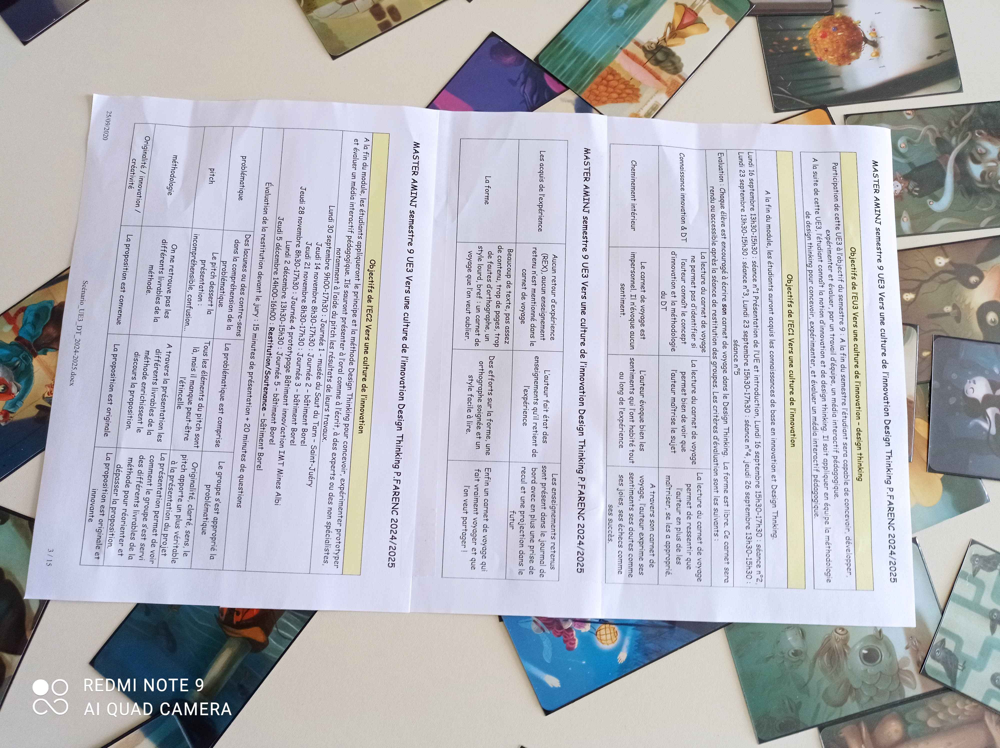

Le planning du cours

J’avais déjà entendu parler de _repair cafés_ mais jamais de _fablabs_. Après en avoir entendu parler un peu plus par Philippe, je me suis rendu compte que les deux étaient très similaires, mais j’ai toujours du mal à cerner la différence entre les deux. Peut-être le _repair café_ est-il plus orienté vers la réparation d’objets, tandis que le _fablab_ est plus orienté vers la création d’objets inédits ?

Notre objectif sera de mettre en place une solution pour permettre aux _fabmanagers_, gérants de _fablabs_, de monter en compétence. Pour ce faire, nous rencontrerons des gestionnaires de _fablabs_ pour comprendre leurs besoins.

J’ai tout de même été surpris par les contraintes du projet : en effet, il est mentionné que la solution devra prendre la forme d’un espace 3D similaire à VEvent. Je ne savais pas ce qu’était VEvent, mais j’ai appris que c’était une plateforme d’événementiel en ligne (telle un métavers) permettant de créer des événements virtuels. J’ai été surpris par cette contrainte, persuadé que le cours devait au contraire nous apprendre à nous affranchir des contraintes pour trouver des solutions innovantes. Certes, j’ai souvent entendu dire que les contraintes stimulent la créativité, et j’en ai moi-même fait l’expérience, mais je ne m’attendais pas à ce que le cours nous impose une solution aussi précise.

Nous allions également devoir réaliser un journal de bord au format que nous souhaitions. J’ai donc pris des notes à chaque séance sur ce que nous avons fait et appris.

## Lundi 23 septembre 2024

Ce jour nous étudiâmes la méthode du _design thinking_.

Toutes les informations sont à retrouver dans les autres documents accessibles depuis le [menu principal](README.md).

En plus de la méthode en 5 partie, illustrée par l’exemple du caddie réinventé par IDEO, nous avons également étudié le _Business Model Canvas_ et le _Value Proposition Design_, deux outils permettant de définir un projet de manière plus précise.

Philippe insiste également sur de nombreux conseils pour mener à bien un projet : rester humble, se méfier de soi-même lors de la conception, trouver un produit « **désirable** » par le marché, rester enthousiaste et de bonne humeur, et utiliser le profilage de personnalité pour constituer une équipe équilibrée.

Ce cours était intense en information et j’ai eu du mal à tout suivre de façon attentive. Heureusement, tout est noté ici. 😅

Nous avons également formé les groupes pour le projet à venir : je me suis retrouvé avec quatre camarades avec lesquels j’ai déjà travaillé (étant dans une petite promotion, c’est assez fréquent). Enthousiasmés, nous avons décidé de nous appeler les **_i-Penseurs_**.

Pour nous entraîner à utiliser la carte d’empathie, il nous a encouragé à en réaliser une pour quelqu’un de notre choix : j’en ai ainsi réalisée une pour mon camarade de classe Antoine, qui, lors de notre discussion sur Discord, venait de finir de faire le ménage chez lui.

### _Empathy map_ : « Antoine qui fait le ménage »

| Questions | Réponses |
|-----------|----------|
| **Que ressent-il et pense-t-il ?** | - Comment faire les choses bien, de façon optimisée ? ; - Satisfaction, apaisement ; - Fatigue. |
| **Qu’entend-il ?** | - Sa musique dans les oreilles ; - Bruit de l’aspirateur. |
| **Que voit-il ?** | - Sa pièce en train de devenir propre. |
| **Que dit-il / fait-il ?** | - Passé l’aspirateur ; - Passé la serpillère ; - Rangé ses habits. |
| **_Pain_** | - Faire tous les recoins (minutie) ; - Effort physique |
| **_Gain_** | - Vivre dans un lieu sain propre agréable. |

## Jeudi 26 septembre 2024

Ce jeudi nous avons commencé à réfléchir concrètement à notre problématique de _fablabs_ : nous allions devoir déterminer notre cible, nos objectifs, nos acteurs, et ce que nous allions faire.

Nous avons donc déterminé donc **cible** : elle allait être double, avec d’un côté les **_fabmanagers_** et de l’autre les **animateurs**, qui sont amenés à présenter des activités, par exemple, dans des écoles.

En nous mettant à leur place, d’une manière similaire à celle de l’**empathy map**, nous avons déterminé quels sont les objectifs habituels de ces deux cibles, et ce qu’ils attendent de nous.

Nous avons bien déterminé que deux types d’apprentissage sont à distinguer : l’apprentissage par **formation**, allant du sachant à l’apprenant, et l’apprentissage par **transmission**, allant également du sachant à l’apprenant mais de l’apprenant au sachant : il s’agit d’un échange de connaissances.

Généralement, cela passe par une **ingénierie pédagogique** : on détermine les **objectifs**, les **activités**, puis enfin l’**évaluation**.

## Lundi 30 septembre 2024

Cette journée était très spéciale : nous étions tous conviés à une visite du **_Musée du Saut du Tarn_**, à **_Saint-Juéry_**. Je ne savais absolument pas en quoi cela allait consister, mais j’étais très curieux. Arrivé après une petite séquence de covoiturage avec quelques camarades, nous avons été accueillis par Philippe ainsi qu’une guide du musée.

Nous avons été installés dans une salle de réunion, où nous avons été invités par Philippe à jouer à un petit jeu de carte en équipe : nous devions, chacun notre tour, confier aux autres membres de l’équipe le soin de choisir pour nous un animal totem (différent de celui que nous avions choisi au premier cours !) Celui-ci a pour objectif de représenter notre personnalité. J’ai ainsi été choisi pour être une **baleine minutieuse**.

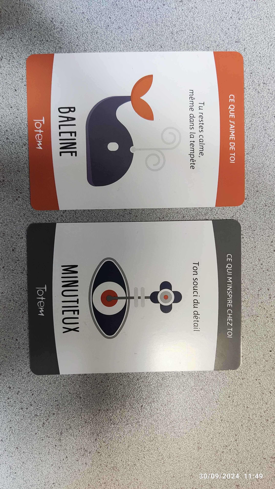

La baleine minutieuse

Nous avons également réalisé un exercice de communication qui m’a rappelé une épreuve de Fort Boyard : nous devions, par trois, reconstruire une pyramide de gobelets en plastique, en utilisant uniquement une corde chacun, toutes reliées à un élastique : celui-ci devait être tendu pour soulever les gobelets. En plus de cela, une contrainte supplémentaire s’est ajoutée : nous devions réaliser l’exercice avec une personne aveuglée et une personne muette. J’ai été l’aveuglé, et n’ai pas brié par mes compétences de représentation spatiale… (Si je puis me permettre, les instructions de mon camarade n’ont pas été très claires non plus !)

(Quel désastre… Désolé Nada !)

Nous avons également réalisé une visite du musée. Je me demandais alors quel rapport la visite pouvait bien avoir avec notre sujet de _fablabs_. J’ai alors compris que le but était de nous montrer des exemples de méthodes de transmission de savoirs, en prenant pour exemple les artisans et leurs apprentis. À l’époque, la transmission était principalement orale et par mimétisme : il ne reste pas ou peu d’écrit décrivants les méthodes de l’industrie qui y était pratiquée.

Pour terminer la visite, nous avons pu admirer une magnifique maquette du **_Saut du Tarn_**, qui nous a été présentée par la guide. En plus de s’illuminer, il est possible de faire couler l’eau de la rivière, ce qui rend le spectacle encore plus impressionnant.

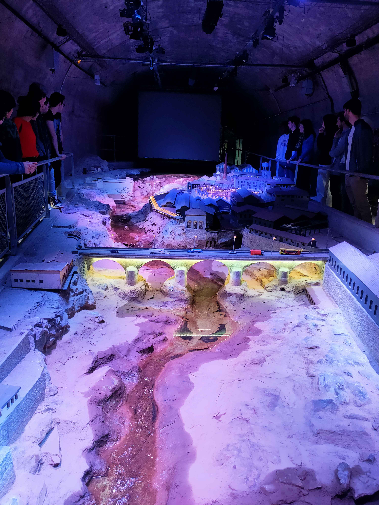

La maquette du Saut du Tarn

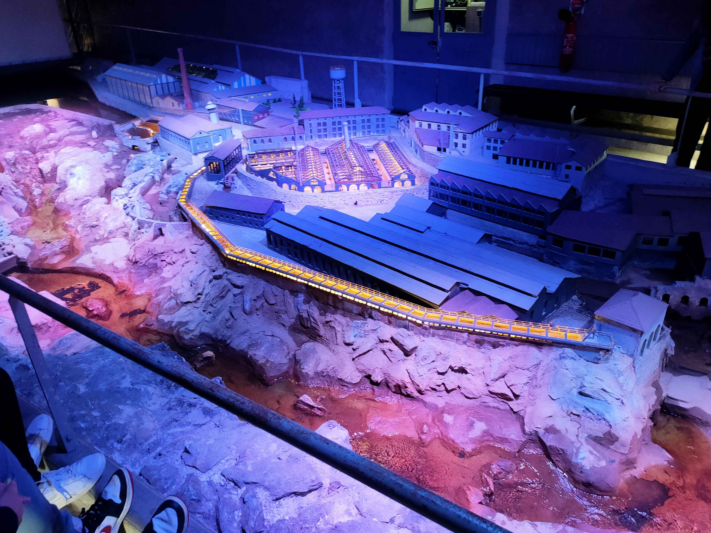

Une autre vue de la maquette

À la suite de la visite, nous sommes retournés travailler dans la salle de réunion, où nous avons réalisé un **_brainstorming_** sur les trois éléments du modèle _Value Proposition Design_ : les **_jobs_**, les **_pains_**, et les **_gains_**. Nous avons ainsi pu déterminer les besoins de nos cibles, les _fabmanagers_.

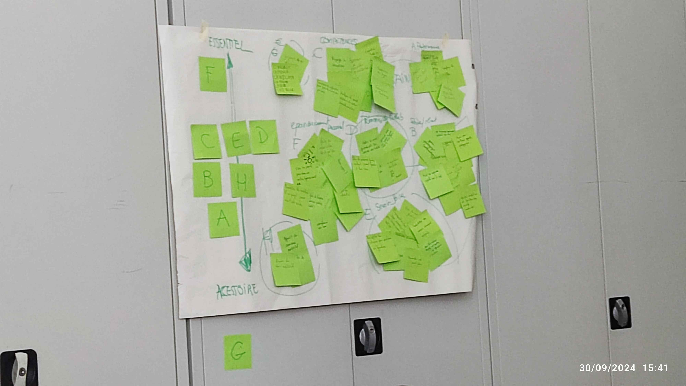

Un mur de post-its, résultat de notre brainstorming

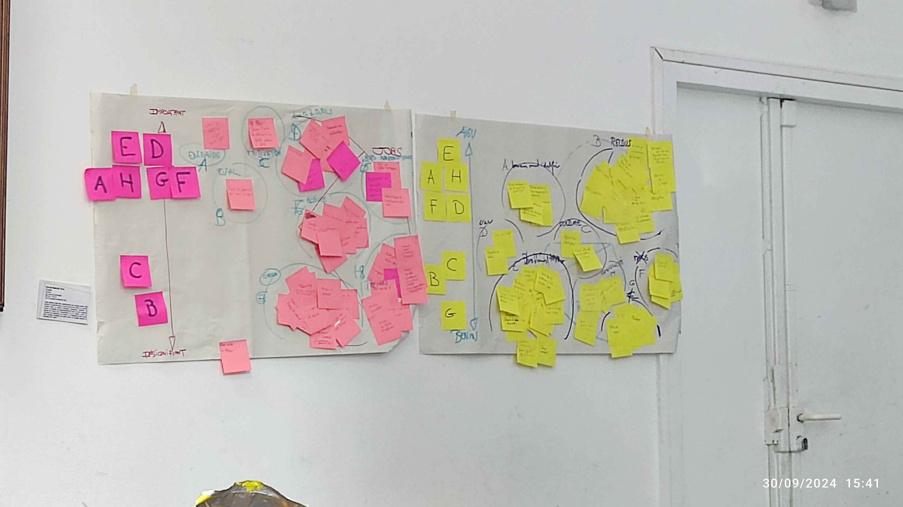

Un autre mur de post-its

La journée s’est terminée par l’intervention de trois personnes, toutes travaillant dans des _fablabs_ : deux étaient gérants des fablabs _Albilab_ et du _FabLab_ de l’**_IMT Mines Albi_**, et la troisième était un animateur ayant rejoint très récemment _Albilab_. Nous avons pu les questionner sur leur travail, leurs besoins, et leurs attentes. Les attentes du professeur étaient cependant assez floues pour mois, je n’avais pas tout à fait compris ce qui allait suivre.

## Jusqu’au 14 novembre…

Après discussion avec mes camarades, j’ai compris que nous étions en autonomie pour travailler sur notre projet : il s’agissait de la phase d’**immersion**. Après de nombreuses semaines à se dire que peut-être allait-il falloir le faire un jour, nous avons pris rendez-vous (en même temps que les autres groupes) avec nos interlocuteurs de la visite du musée. Nous étions peu motivés car la problématique donnée au début du cours ne correspondait, selon nos interactions avec le personnel des _fablabs_, à aucune réalité. Nous avons cependant réalisé des entretiens avec eux, et avons également visité les locaux des deux _fablabs_.

Visite d’Albilab

Coup de chance lors de notre visite d’Albilab, nous avons pu rencontrer un client qui cherchait à savoir si le _fablab_ avait rouvert (il était cependant uniquement ouvert pour notre visite). Nous avons pu lui poser quelques questions sur son utilisation du _fablab_ et ses attentes. Monsieur nous a expliqué qu’il venait entre autre pour réparer son électroménager, et qu’il avait déjà réalisé une pièce en plastique pour réparer sa machine à laver.

Visite du FabLab de l’IMT Mines Albi

Nous n’avons pas réellement rencontré de _fabmanagers_ : nous avons rencontré des administrateurs, des gestionnaires, des médiateurs technologiques.

Cette phase d’immersion a confirmé nos doutes sur la problématique donnée au début du cours. Nous avons donc décidé de le faire part à Philippe lors de notre retour en cours.

Par ailleurs, Philippe nous avait également conseillé de profiter de cette phase d’immersion pour, je cite, « vivre une expérience inspirante ». Étant moi-même très averse à l’idée de sortir de ma zone de confort, je n’étais pas très motivé pour le faire. Cependant, des occasions se sont présentées, et je pense pouvoir dire que j’ai effectivement vécu deux expériences inspirantes : tout d'abord, une sortie avec des amis au marché des sorcières de Cordes-sur-Ciel, où j’ai pu découvrir des artisans locaux et des produits artisanaux, ainsi que rencontrer des voyantes (étant moi-même très cartésien, il s’agissait bien là d’une découverte). J’ai également participé à une séance d’_escape game_ à la bibliothèque universitaire, où nous avons du résoudre le mystère du pharaon Toutankhamon. Cette dernière expérience s’est révélée être un _serious game_ sur la circulation d’informations erronnées, ce qui m’a permis de réfléchir à la manière d’utiliser le jeu pour la prévention.

## Jeudi 14 novembre 2024

Pour le retour en cours, nous avons entamé la phase de **recadrage**. Nous avons discuté de nos analyses par rapport à la problématique et de nos visites aux _fablabs_.

Nous avons fait part à Philippe de nos doutes quant à la pertinence de la problématique donnée au début du cours. Les problèmes décrits par nos interlocuteurs ne correspondaient pas à ceux décrits par la problématique : en effet, le personnel des _fablabs_ que nous avons rencontré ne nous ont pas une seule fois parlé de problème de pédagogie, mais plutôt de problèmes de gestion, de communication, et de financement.

Malgré cela, Philippe nous a encouragé à continuer sur cette même problématique, ce qui était assez frustrant. 

Nous avons été encouragés à réecrire la problématique de façon à ce qu’elle corresponde à notre idée des choses. Nous avons décidé de nous concentrer sur tout le personnel des _fablabs_ de petite échelle, comme c’est ce que nous avons rencontré.

La phrase de la problématique a été rédigée à partir d’une phrase à trous à remplir suggérée par Philippe, que voici.

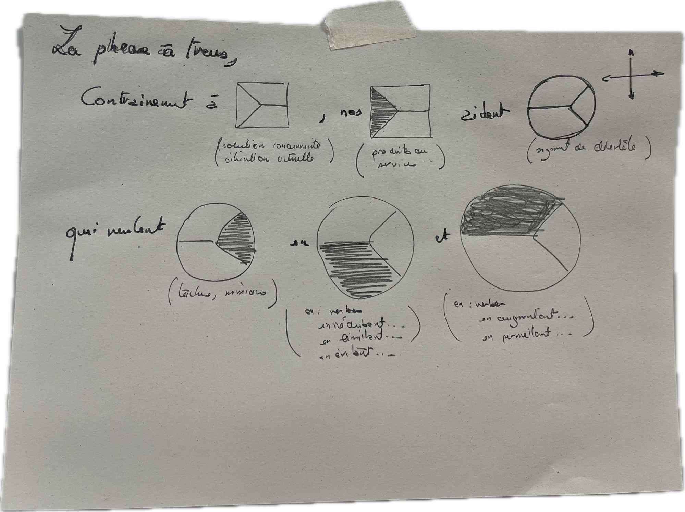

La phrase à trous

Nous avons fait la liste des _jobs_, des _pains_, et des _gains_ des personnels en petits _fablabs_, et les avons rassemblés en un archétype qui sera notre client.

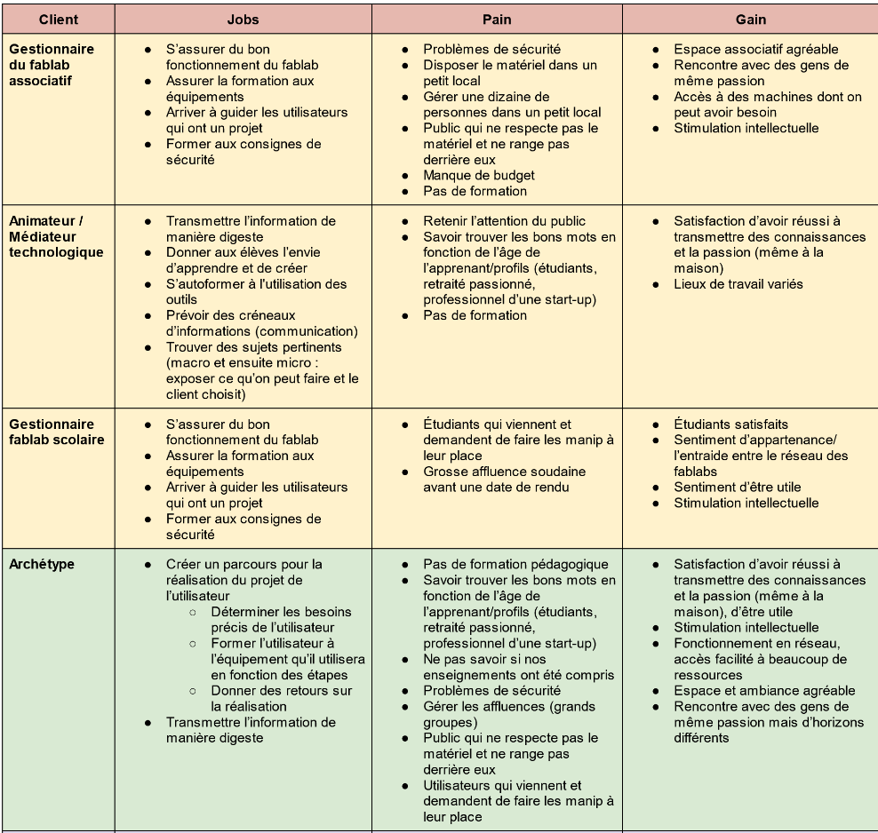

L’archétype de notre client

À partir de cet archétype, nous avons rempli un tableau _before_ / _after_ censé résumer les avantages que notre solution apporterait à notre archétype.

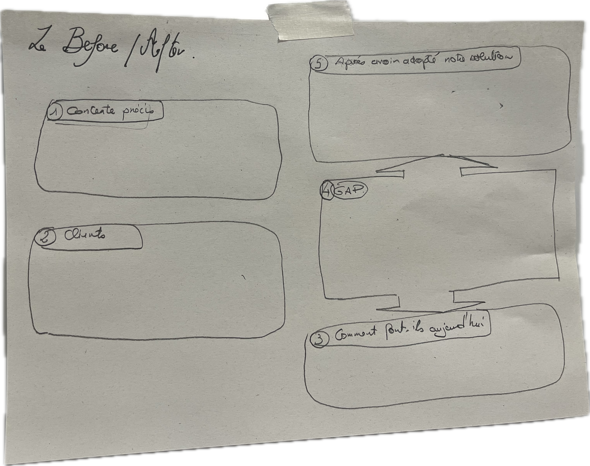

Tableau before / after

Nous avons également commencé à réfléchir à des idées pour résoudre les problèmes de notre archétype.

Nous avons utilisé la méthode des six chapeaux (bien que nous n’en n’ayons utilisé que trois) pour critiquer les idées d’un autre groupe. Nous avons ainsi pu donner notre avis sur les idées d’un autre groupe, et ils ont pu donner le leur sur les nôtres. J’ai moi-même porté le chapeau de la personne critique de l’**organisation**, le chapeau **blanc**.

Nous avons ainsi pu déterminer les idées les plus pertinentes pour notre projet en fonction des retours des autres groupes… Tout du moins en théorie, mais je ne pense pas pouvoir dire que nous ayons réellement retiré quelque chose de cette activité.

J’étais également confus durant cette partie là car nous devions présenter notre concept avant d’avoir commencé la phase d’imagination, ce qui me semblait un peu prématuré. Qu’étions-nous censés présenter ? Une idée que nous n’avions pas encore ?

## Jeudi 21 novembre 2024

S’en est ensuivi la partie **immersion**, et, avec elle, une nouvelle session de _brainstorming_ (selon Philippe, la _purge_) durant laquelle nous avons sorti toutes nos idées sur des post-its, à la fois des problèmes à résoudre et des solutions possibles. Nous avons ensuite trié ces idées en les regroupant par thèmes.

Nous avons également chacun réparti des gommettes sur les idées que nous trouvions les plus pertinentes et plus innovantes.

J’étais, durant cette partie, très peu inspiré et malgré ça ait été l’un des plus prolifiques en idées, ce qui me fait penser que nous étions tous dans le même cas.

Les post-its de la phase d’imagination

Suite à cette phase, nous avons réalisé une phase de **scénatio catastrophe**. Nous avons écrit des post-its avec des idées de comment faire échouer le projet, puis nous les avons froissés, balancés au milieu, et lus un par un pour trouver des solutions. Ces solutions furent ajoutées sur des post-its, accrochés à côté des autres.

Nous avons, à partir de ces idées, créé trois concepts différents, que nous avons ensuite décrits sur des fiches concepts. Nous avons ensuite scénarisé ces concepts, en imaginant comment ils pourraient se dérouler.

Toute cette partie fut éprouvante mentalement, la motivation n’étant pas au rendez-vous. Nous étions au départ censés réaliser cinq fiches concepts, mais nous n’en avons réalisé que trois.

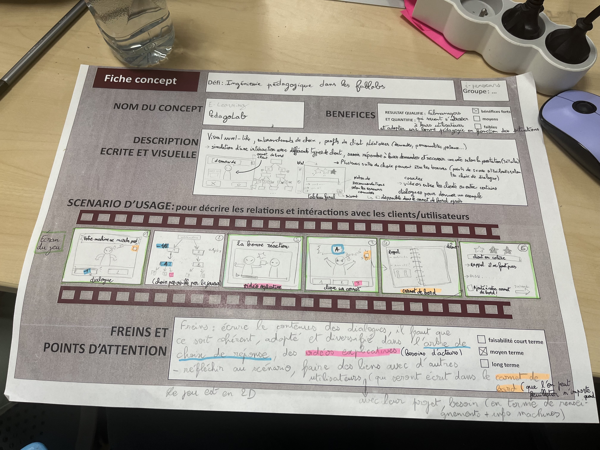

Le premier concept. Une sorte de visual novel pour apprendre à gérer un les clients d’un fablab.

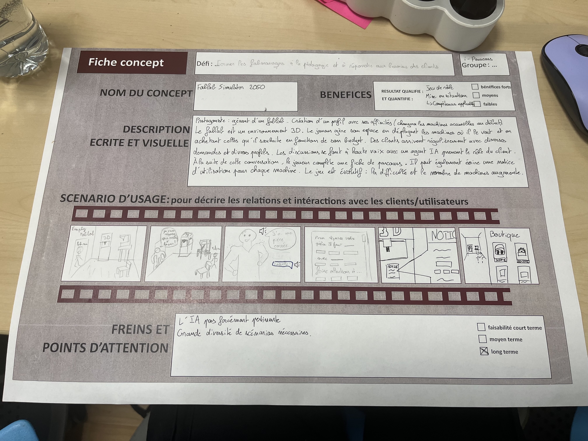

Le deuxième concept. Un simulateur de fablab, incluant la gestion d’un budget en plus de devoir accueillir les clients.

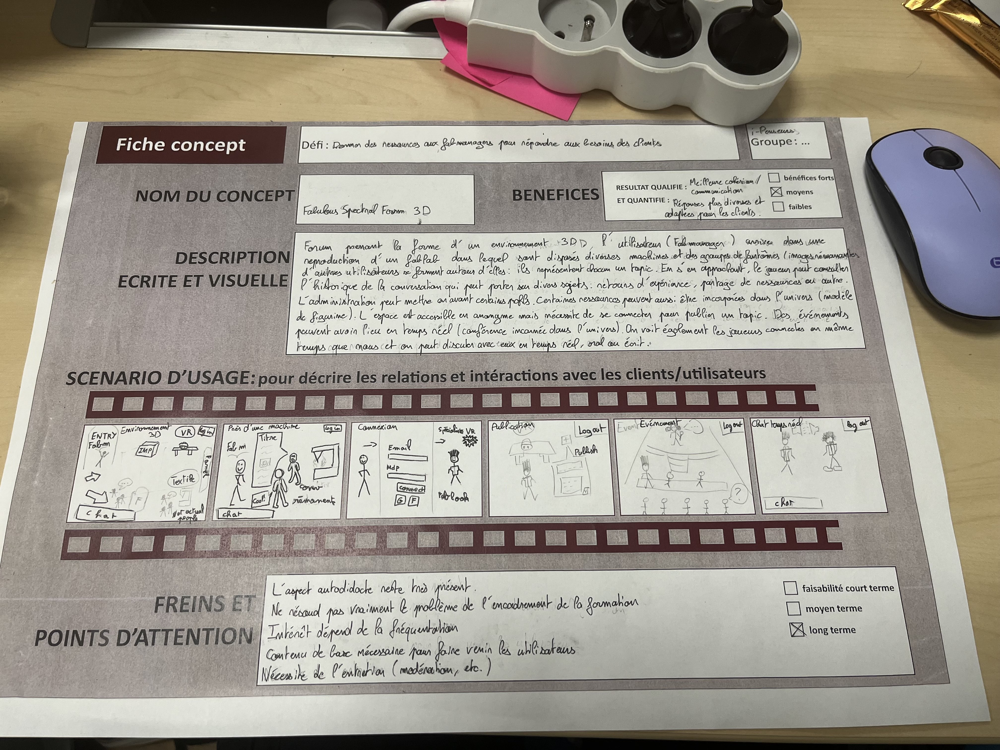

Le troisième concept. Une sorte de fusion de métavers et de forum, où les fabmanagers pourraient échanger leurs expériences et partager des ressources utiles.

Philippe nous a dit qu’il déciderait d’une des trois idées pour la suite du projet, que nous allons devoir prototyper.

## Jeudi 28 novembre 2024

Nous avons passé la journée de **prototypage** au **_Bâtiment Innov’Action_** de l’**_IMT Mines Albi_**. Après une introduction au concept de **prétotype**, un prototype qui n’a pas besoin d’être fonctionnel et doit être réalisé rapidement (presque une sorte de _mock-up_), Philippe nous a rendu la fiche concept du premier concept que nous avions réalisé la semaine précédente : nous allions donc avoir à réaliser une maquette de _visual novel_. 

Nous avons été un peu surpris par le choix : ce concept nous semblait être le moins innovant du lot. Cependant, nous avons du nous y plier.

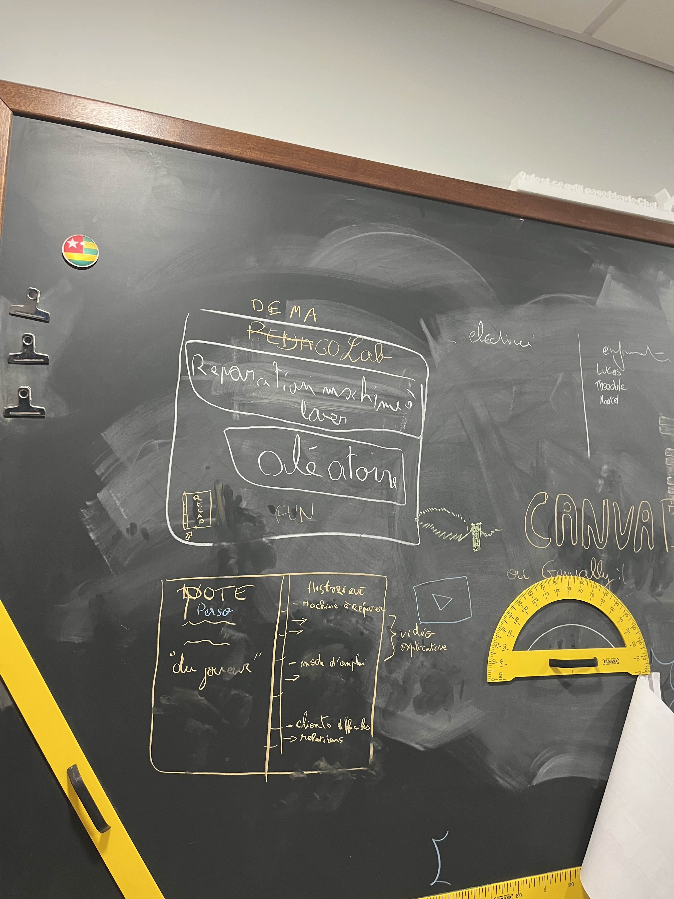

Gribouillage de la maquette de visual novel sur le tableau

Après mure réflexion (et de nombreuses réalisations hors-sujet en Legos), nous avons décidé de le réaliser sur papier, en dessinant les différentes scènes et en les reliant par des numéros de pages à la manière d’un livre dont vous êtes le héros.

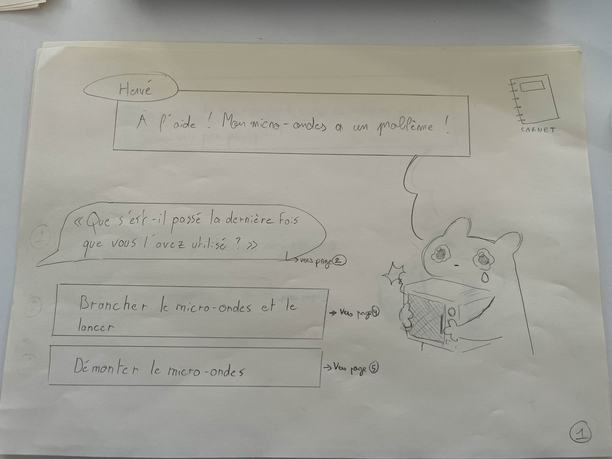

Le prétotype de visual novel

La journée s’est terminée par notre présentation du prétotype à Philippe, qui nous a donné des conseils pour la suite du projet.

## Lundi 2 décembre 2024

Cette journée fut moins intense que la précédente : Philippe nous a parlé de la phase de test et de déploiement, et nous a surtout donné des conseils pour notre soutenance. Cela incluait surtout des conseils sur comment faire une bonne présentation, en mentionnant notamment le livre de **Dan Roam** et le concept du **_Golden Circle_**.

Nous avons passé le plus clair de notre temps à commencer la réalisation du support de notre présentation, mais Philippe nous a également aiguillé en nous conseillant de réfléchir le plan en trois parties et trois sous-parties, et de ne pas hésiter à répéter notre présentation pour la rendre plus fluide, ce que nous avons au final assez peu fait.

## Mardi 3 décembre 2024

Enfin, notre soutenance fut mardi. Nous avons présenté notre projet, le _visual novel_, et avons répondu aux questions de Philippe et de nos camarades.

J’étais bien content que ce soit terminé, et j’ai été soulagé de voir que notre présentation s’était relativement bien passée. J’étais surtout soulagé de pouvoir penser à autre chose.

[← Retour au menu](README.md)